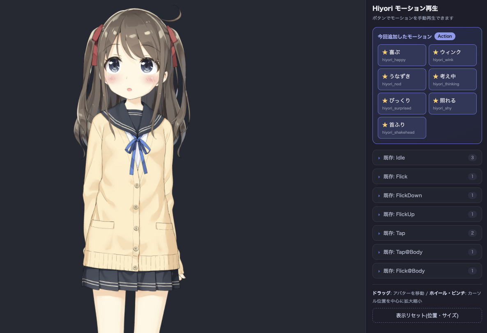

# live2d-add-motion-sample-web-ui

**Add new motions to a Live2D model by editing JSON only — no Cubism Editor required.** Comes with a browser-based WebUI.

[日本語版READMEはこちら](README.ja.md)



<sub>Sample model: Hiyori Momose ©Live2D (model data is NOT included in this repository)</sub>

## What is this?

A Live2D motion file (`.motion3.json`) is just JSON — a set of keyframe curves per model parameter. That means you can create new motions with a text editor alone, as long as you stay within the parameters the model already has. No rigging, no mesh editing.

This repository adds the following 7 motions to the official Live2D sample model "Hiyori", using JSON only:

| Motion | Main parameters used |
|---|---|
| Happy | Smiling eyes (EyeSmile) + mouth form + cheek blush + body bounce |
| Wink | Single-eye blink + head tilt |
| Nod | Head pitch (double nod) |
| Thinking | Head tilt + averted gaze + furrowed brows |
| Surprised | Widened eyes + raised brows + "o" mouth + lean back |
| Shy | Cheek blush + looking down + lowered eyelids |
| Head shake | Head yaw oscillation |

For reproducibility, motions are not hand-written: they are built by a pipeline of **a generator script + an independent validator + headless-browser verification**. The repository also ships agent-facing documentation ([AGENTS.md](AGENTS.md)) so you can ask an AI agent (Claude Code, Codex, etc.) to "add a new motion" and have it work autonomously.

## Quick start

Requirements: **Python 3** (standard library only), a **modern browser**, and a coding agent such as Claude Code / Codex.

```bash
git clone https://github.com/shinshin86/live2d-add-motion-sample-web-ui.git
cd live2d-add-motion-sample-web-ui
```

Launch your agent at the repository root and **just ask, mentioning where your model is**:

> There is a Live2D model at `~/Downloads/model.zip`. Add motions to this model and make them viewable in the browser.

The agent handles everything — placing the model, setup, motion design, generation, validation, and starting the server (the workflow is defined in [AGENTS.md](AGENTS.md), which agents read automatically). A zip or a folder works, located anywhere.

If you don't have a model, download the official sample model ["Hiyori Momose (hiyori_pro)"](https://www.live2d.com/en/learn/sample/momose-hiyori/) — the bundled sample motion definitions work with it out of the box.

Adding or changing motions is also just a request:

> Add a "waving hand" motion to this model. If it cannot be made naturally with the existing parameters, do not force it — propose alternatives instead.

### Run manually

```bash
python3 tools/setup_model.py <model zip or folder>   # place model + generate model.config.json
python3 tools/gen_motions.py        # generate + register motions
python3 tools/validate_motions.py   # validate (should print "OK")

pnpm run dev                        # serve (default port: 17342)
# or: python3 tools/serve.py
# → http://localhost:17342
```

Motion definitions live in `motion-defs/<model-name>.py`, one file per model (a sample definition is bundled as a reference). A different model needs its own definitions matching its parameters — that design work is exactly what you delegate to the AI agent. Definition files are treated as per-model workspace artifacts and are git-ignored just like `models/`, so switching models never dirties the repository.

## Using the WebUI

- Choose an avatar from the selector. Hiyori is always the default, **Generate new…** is always second, and completed local generations are listed below it.
- **Generate new…** opens a description flow that runs Gemini image generation → See-through layer decomposition → automatic Live2D rigging, then reloads the page with the new avatar selected.
- Play the newly added motions from the highlighted card (★ buttons); existing motions are in the collapsible sections below
- **Drag** the avatar to move it, **mouse wheel / pinch** to zoom around the cursor, and "Reset view" to restore the initial placement
- Debug query parameters: `?play=Action:0` (auto-play), `&freeze=1.2` (freeze the pose at a given second), `?uitest=1` (automated drag/zoom test)
- The UI defaults to English and automatically uses Japanese when the browser's primary locale is Japanese. Use `?lang=en` or `?lang=ja` to override locale detection.

## Adding your own motions

If you use an AI agent, just reuse the prompt from the quick start (change the motion name). To do it manually:

1. `python3 tools/analyze_model.py` — inspect available parameters, their safe value ranges, and physics-driven parameters (do not animate those directly)
2. Add your keyframes to `motion-defs/<model-name>.py` (see the bundled sample for the format)
3. Generate → validate → verify in a browser:

```bash
python3 tools/gen_motions.py
python3 tools/validate_motions.py
tools/verify_browser.sh   # captures peak poses with headless Chrome (Chrome required)
```

Design rules (value ranges, returning to the base pose, avoiding physics-driven parameters, etc.) and model-specific knowledge are documented in [AGENTS.md](AGENTS.md). It is written for AI agents but useful for humans too.

## See-through companion (experimental)

The `investigate/seethrough-metal` branch includes a separately tracked
See-through submodule for turning one anime illustration into a layered PSD on
Apple Silicon. Initialize it with `git submodule update --init --recursive`,
then see [docs/see-through-metal.md](docs/see-through-metal.md) for the pinned
MPS patch, reproducible profiles, and current depth-output limitation.

## Generate a Live2D avatar from a description (experimental)

The branch also vendors [`image2live2d`](https://github.com/Wzhang3912/image2live2d)
as the automatic rigging bridge. The local flow keeps the Gemini API key on the
Python server and reads it from the existing Hallway `.env` by default; the key
is never sent to browser JavaScript or copied into this repository.

```bash
git submodule update --init --recursive
python3 tools/setup_avatar_pipeline.py
python3 tools/serve.py
# → choose “Generate new…” in the Avatar selector
```

The first generation downloads the See-through model weights (roughly 10–15 GB)
and is much slower than later runs. Generated concepts, PSDs, Live2D bundles,
and the avatar registry stay under git-ignored `local-assets/`. The server binds
to `127.0.0.1` by default because it can access the local Gemini credential.

Set `LIVE2D_HALLWAY_ENV=/path/to/.env` to use another credential file. Set
`SEE_THROUGH_PROFILE=community-quality` before starting the server to use the
1280/30-step profile instead of the validated 768/20-step MPS smoke profile.
See [docs/avatar-generation.md](docs/avatar-generation.md) for architecture,
verification, and current quality limits.

## Repository layout

```
index.html, app.js, styles.css
                            WebUI (no build step); avatar selector + generation flow
tools/
  setup_model.py            Place a model (zip/folder → models/) + generate model.config.json
  analyze_model.py          Analyze parameters, value ranges, physics outputs
  gen_motions.py            Generation engine (model-agnostic); builds + registers motions from definitions (idempotent)
  validate_motions.py       Independently implemented validator
  serve.py                  Local WebUI + avatar-job API server (default port: 17342)
  run_seethrough.py         Launch the vendored layer-decomposition companion
  rig_avatar.py             Convert a See-through PSD into a complete Live2D bundle
  setup_avatar_pipeline.py  Create the isolated Python 3.12/MPS environment
  verify_browser.sh         Real-rendering verification with headless Chrome
                            (assumes the macOS Chrome path; override with env CHROME)
motion-defs/<model>.py      Motion definitions (creative content, one file per model)
                            [git-ignored; only the bundled sample is tracked]
AGENTS.md                   Working guide for AI agents
model.config.json           [git-ignored] current model configuration (generated by setup_model.py)
local-assets/ , models/     [git-ignored] Live2D model data (not included for licensing reasons)
vendor/see-through/         Pinned See-through Git submodule (investigation branch only)
vendor/image2live2d/        Pinned automatic rigging bridge Git submodule
```

## License

The original parts of this repository (HTML / scripts / documentation) are licensed under the [MIT License](LICENSE).

The following are NOT covered by MIT and are subject to their own licenses:

- **Live2D sample model "Hiyori"**: covered by the [Live2D Free Material License](https://www.live2d.com/eula/live2d-free-material-license-agreement_en.html); redistribution is prohibited, so it is not included here. Download it yourself from the [official distribution page](https://www.live2d.com/en/learn/sample/momose-hiyori/). The copyright of the model shown in the README screenshot belongs to Live2D Inc.
- **Live2D Cubism Core** (`live2dcubismcore.min.js`): loaded by the WebUI from the official Live2D CDN ([Live2D Proprietary Software License](https://www.live2d.com/eula/live2d-proprietary-software-license-agreement_en.html)). This repository does not redistribute the Core itself. If you release a product embedding the SDK as a business, a [publication license](https://www.live2d.com/en/sdk/license/) may be required depending on your business scale.
- **PixiJS / pixi-live2d-display**: loaded from CDNs (both MIT licensed).
- **See-through** and **image2live2d**: separately tracked Apache-2.0 dependencies. The latter's native `.moc3` writer is used experimentally; review Live2D's SDK and publication terms before distributing generated models in a product.
